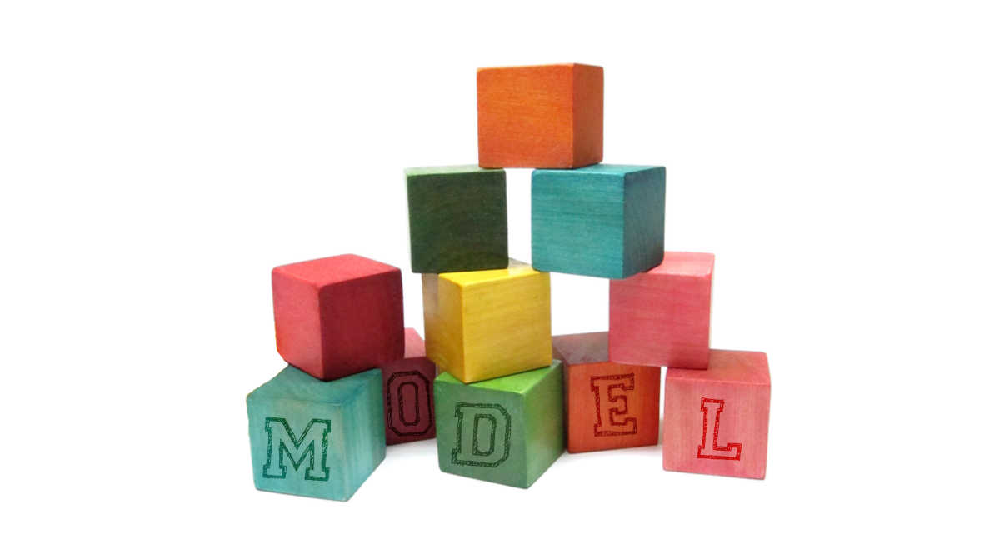

> A Modeling abstraction for Firebase Applications

## Description

A library to:

- Define database schemas in Typescript and target NodeJS or client-run JS 
- Use structured/typed data knowledge to interact with a Firebase database
- Leverages the `firemock` library to use mocking easily and effectively (with auto-sensing type mock generation)
- Optionally use Redux integration for dispatch and/or actions

## Installation

```sh
npm install firemodel
# or
yarn add firemodel
```

## Documentation

Documentation can be found at: [http://www.firemodel.info](http://www.firemodel.info). If your reading on a mobile device, be sure to use the hamburger menu at the top for the table of contents.

## Contributing 

I have developed this module selfishly for my own needs but as with all my other open-source work I'd be happy to recieve PR's and issues. Not surprisingly, PR's are my preference but sometimes people don't feel they have the right skills or time to fix something they feel is broken so raising issues is a nice way to communicate something you've noticed. I can't promise issues will always get immediate attention but I will get back as soon as I can.

## License
<span style="font-family: monospace">
  Copyright (c) 2017 LifeGadget Ltd

  Permission is hereby granted, free of charge, to any person obtaining a copy of
  this software and associated documentation files (the "Software"), to deal in
  the Software without restriction, including without limitation the rights to
  use, copy, modify, merge, publish, distribute, sublicense, and/or sell copies
  of the Software, and to permit persons to whom the Software is furnished to do
  so, subject to the following conditions:

  The above copyright notice and this permission notice shall be included in all
  copies or substantial portions of the Software.

  THE SOFTWARE IS PROVIDED "AS IS", WITHOUT WARRANTY OF ANY KIND, EXPRESS OR
  IMPLIED, INCLUDING BUT NOT LIMITED TO THE WARRANTIES OF MERCHANTABILITY,
  FITNESS FOR A PARTICULAR PURPOSE AND NONINFRINGEMENT. IN NO EVENT SHALL THE
  AUTHORS OR COPYRIGHT HOLDERS BE LIABLE FOR ANY CLAIM, DAMAGES OR OTHER
  LIABILITY, WHETHER IN AN ACTION OF CONTRACT, TORT OR OTHERWISE, ARISING FROM,
  OUT OF OR IN CONNECTION WITH THE SOFTWARE OR THE USE OR OTHER DEALINGS IN THE
  SOFTWARE.
</span>
