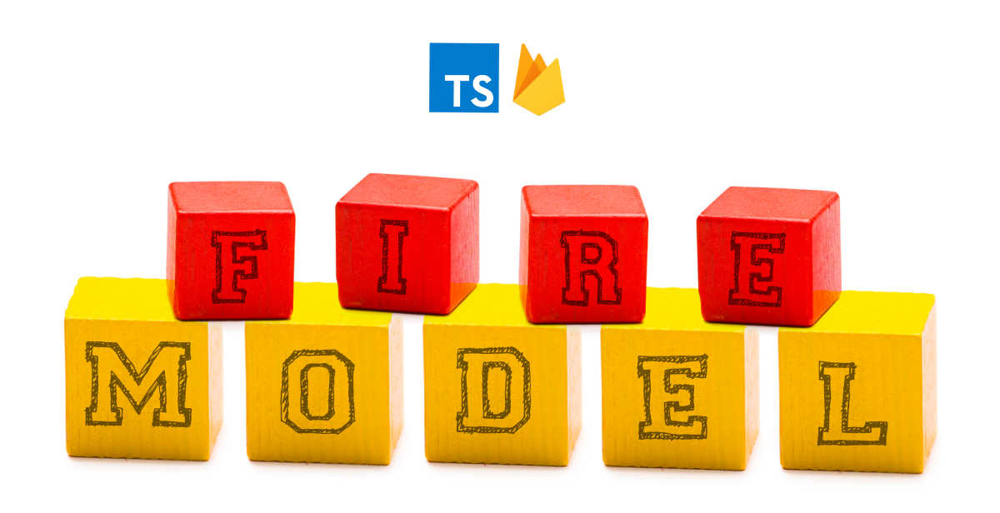

> A Modeling abstraction for Firebase Applications

## Installation

```sh
npm install firemodel
```

## Documentation

Documentation can be found at: [http://www.firemodel.info](http://www.firemodel.info). If your reading on a mobile device, be sure to use the hamburger menu at the top for the table of contents.

## Contributing 

I have developed this module selfishly for my own needs but as with all my other open-source work I'd be happy to recieve PR's and issues. Not surprisingly, PR's are my preference but sometimes people don't feel they have the right skills or time to fix something they feel is broken so raising issues is a nice way to communicate something you've noticed. I can't promise issues will always get immediate attention but I will get back as soon as I can.

## License

Copyright (c) 2017 LifeGadget Ltd

Permission is hereby granted, free of charge, to any person obtaining a copy of
this software and associated documentation files (the "Software"), to deal in
the Software without restriction, including without limitation the rights to
use, copy, modify, merge, publish, distribute, sublicense, and/or sell copies
of the Software, and to permit persons to whom the Software is furnished to do
so, subject to the following conditions:

The above copyright notice and this permission notice shall be included in all
copies or substantial portions of the Software.

THE SOFTWARE IS PROVIDED "AS IS", WITHOUT WARRANTY OF ANY KIND, EXPRESS OR
IMPLIED, INCLUDING BUT NOT LIMITED TO THE WARRANTIES OF MERCHANTABILITY,
FITNESS FOR A PARTICULAR PURPOSE AND NONINFRINGEMENT. IN NO EVENT SHALL THE
AUTHORS OR COPYRIGHT HOLDERS BE LIABLE FOR ANY CLAIM, DAMAGES OR OTHER
LIABILITY, WHETHER IN AN ACTION OF CONTRACT, TORT OR OTHERWISE, ARISING FROM,
OUT OF OR IN CONNECTION WITH THE SOFTWARE OR THE USE OR OTHER DEALINGS IN THE
SOFTWARE.

## Overview

This library wraps the [`abstracted-admin`](https://www.abstracted-admin.com/) npm module to provide another layer of functionality targeting building "models" within your Firebase backend. As a simple example you can define a model as: 

```ts
import Model, { Relationship, IBaseModel, RelationshipPolicy } from 'firemodel';

export interface IPerson extends IBaseModel {
  name: string;
  age: number;
  father: Relationship<T>('belongsTo', RelationshipPolicy.keys);
  mother: Relationship<T>('belongsTo', RelationshipPolicy.lazy);
  children: Relationship<T>('hasMany', RelationshipPolicy.inline);
}

export default class Person extends Model<IPerson> {
  constructor() {
    this.prefix = '/auth';
    this.audit = false;
    this.mockSchema: MockGenerator = (h) => () => ({
      name: h.faker.name.firstName(),
      age: h.faker.number({min: 1, max: 100})
    });
  }
}
```

and then you can use it in many ways such as:

```ts
import DB from 'abstracted-admin';
import Person from './person';
// Connect to DB
const db = new DB();
const person = new Person(db);
// Connect to mock DB
const mockDB = new DB({ mocking: true });
const mockPerson = new Person(mockDB);
// generate mocks in DB
mockPerson.generate(10);
mockPerson.generate(10, { age: 15 });

// one time, async retrievals 
const joe = await person.getOnce(key: string);
const people = await person.getOnce();        // value/once retrival of all records
const people = await person
  .orderByKey('age').limitToFirst(10)
  .getOnce();                                 // value/once retrival of filtered/sorted records

// Setup Streaming Events
person.listenToRecord(key: string);           // "value" event listener on individual record
person.listenToRecords(key: string);          // "value" event listener on list of records
person.listenToChildren('added', 'removed');  // 1:M child event listeners
person
  .limitToFirst(10).equalTo('age', 45)
  .listenToChildren('changed');               // 1:M child event listeners with query attached

// Consume Streaming Events: static
const record: T = person.record;              // JS representation of the record (no key in record)
const key: string = person.key;               // the key of the record (if a list-view then blank)
person.toJSON();                              // at any point get JSON hash an individual record
people.toJSON();                              // at any point get an array of records with key included in hash record

// Consume Streaming Events: event
person.on('event', callback);     // respond to all events
person.on('value', callback);     // respond to a specific event: "value", "child_added", etc.

// get relationship
const bobby = await person.getOnce(key: string);
const children = bobby.children();   // sync return of records if "inline"
const children = bobby.children();   // sync return of keys if "keys"
const children = await bobby.children();   // async return of records if "lazy"
```
