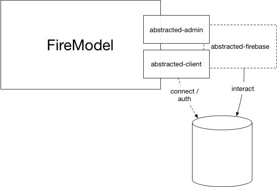

# Installing NPM Modules



## Firemodel and Data Access

The first we need to do to get started is install the required NPM modules and clearly **Firemodel** is one of them:

```shell
yarn add firemodel
```

**Firemodel** has been built in a modular fashion to give you as much flexibility as possible. As a result of this you will need to choose a library to connect to Firebase; there are two similar libraries which will do that: `abstracted-admin` and `abstracted-client`.

As you probably know if you're developing a backend application then you're likely to use the "Admin SDK" and in this case `abstracted-admin` is the tool you want to employ. If you're building a frontend application -- or for whatever reason are using the JS Client SDK -- then you'll use `abstracted-client`:

```shell
# ADMIN SDK
yarn add abstracted-admin
# Frontend JS SDK
yarn add abstracted-client
```

That's all that is required at this point but there is one more optional install:

### FireMock

**Firemodel** integrates seemlessly with the **FireMock** mocking library if you want to use that in your tests. You really should try it. It's pretty slick. Anyway, it's optional and no one will complain if you don't.

```shell
yarn add --dev firemock
```
