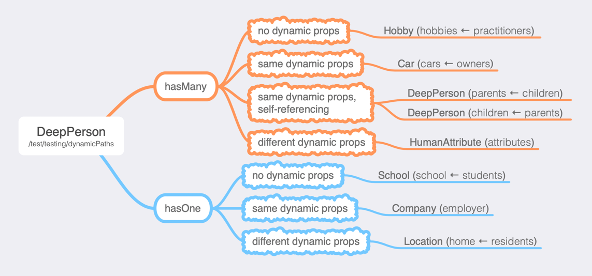

# Dynamic Paths (using)

## Introduction

The term _dynamic-paths_ refers to the use of the [Model Constraint](../modeling/model-constraints.html#database-offseting) property **dbOffset** and specifically the inclusion of a non-static path such as ":group" in that property. Use of dynamic paths is reserved for situations where certain the records of a given Model is divided in large part by a property (or multiple properties) and you want to preserve the ability to query and filter results on the server side beyond these variables or want more fine grained control over the security/permissions of the data in Firebase.

For more on _why_ you might want to use dynamic paths refer to the [**Modeling → Dynamic Paths**](../modelling/dynamic-paths) section.

## Composite Keys

When you are using normal database paths than the `id` property of any given record represents the primary key for the record. Once you've moved to dynamic properties the `id` no longer is guarenteed to provide uniqueness (it _could_ be unique but there is no assurance of that). For this reason the idea of a "composite key" is important to understand.

A composite key is a basket of key/value pairs which _do_ provide a uniqueness gaurentee for records that reside on a dynamic path. In **Firemodel** they are represented in two ways:

```typescript
// an object representation
const compositeKey = {
  id: "12345",
  group: "first-group"
}
// a string representation
const compositeRef = "12345::group:first-group";
```

In some ways these internals aren't critical but they can be helpful in understanding. For instance, relationships will always use the string-based FK references. Alternatively, the object based syntax is more intuitive in normal usage (see API below).

## CRUD

In all CRUD activities the API surface remains consistent but the key is that unlike in non-dynamic paths where you only need an `id` you need the full composite key.

### Getting a Record

```typescript
// using object notation
const product = Record.get(Product, { id: "prod-id", state: "CT"} );
// using string reference notation
const product = Record.get(Product, "prod-id::state:CT" } );
```

### Adding a Record

In the case you want to add a new Record you actually don't need to make any changes just so long as you include values for the properties which make up the composite key :

```typescript
const product = Record.add(Product, { id: "prod-id", state: "CT", ... } );
```

### Updating a Record

The signature is unchanged but the `id` is instead the **Composite Key**.

```typescript
const product = Record.update(Product, { id: "prod-id", state: "CT"}, { ... } );
```

### Removing a Record

```typescript
const product = Record.remove(Product, { id: "prod-id", state: "CT"} );
```

### Getting a List

Unlike operating with `Record`, `List`'s do need a new operator to work effectively. As you see below we've added the `offsets()` modifier; otherwise the API surface is exactly the same.

```typescript
const products = List.offsets({ state: 'CT' }).all(Product);
const products = List.offsets({ state: 'CT' }).where(Product, 'status', 'active');
```

> Note: if you multiple dynamic properties in a path they must **all** be defined in the `offsets()` call (except the `id` itself).

## Watching

### Watching a Record

As is true for the CRUD operations, the watching of a record is effectively unchanged except that one must ensure that all keys of the required composite key are included.

```typescript
const { watchId } = await Watch.record(Product, { id: "1234", state: "CT" })
```

### Watching a List

Similar to the CRUD API, we must state the non-`id` properties of the composite key in the `offsets()` function; otherwise the API remains the same to non-dynamic path models:

```typescript
const { watchId } = await Watch
  .offsets({ state: "CT" })
  .list(Product).all().start();
```

### Relationships

Adding FK Relationships

If you're establishing a FK relationship _from_ a model which has dynamic path to one which does not then the API remains the same. If you are operating in reverse you will need to do one of two things:

1. **Full composite key.** In the example below the FK reference is to a model which has `foo` and `bar` as part of the dynamic path. By stating the explicit values of the composite key the FK will always work.

     ```typescript
     originatingModel.addToRelationship('fkPropertyOnOriginating', {
         id: "[ID VALUE]",
         foo: "abc",
         bar: "def"
      });
     ```

     > Note: `setRelationship` for 1:1 cardinality based relationships take the same syntax

2. **Passthrough.** If the originating model has property values for all of the dynamic segments in the FK then you can simply state the ID as a string (this is just the standard API syntax) and it will assume that the PK and FK have the same values for these properties.

     ```typescript
     originatingModel.addToRelationship(
       "fkPropertyOnOriginating",
       "[ID VALUE]"
     );
     ```

## Mocking

Mocking model's which have dynamic offsets leverages one of two strategies:

1. **Explicit Override.**
    The `generate()` method that hangs off of Mock allows you to override mocking for a set of properties and by including the property which has the prefix you are holding it constant and thereby producing a reasonable result (e.g., *reasonable* because a prefix property should always be a bound set of values not a random mock)

    ```typescript
     await Mock(Product, db).generate(10, { state: "CT" });
    ```

    If you wanted to mock several different *states* (in this example) then you could simple have a line item for each.

2. **Constrained Mocks**.
    There are two _named mocks_ which you can use to your advantage to maintained a constrained set of mocks. They are `random` and `sequence`; both take a discrete set of values as options and therefore they result in a natural data pattern for mocked data. Here is an example where we use both. The model would be:

     ```typescript
    @model({ dbOffset: ':state/:category' })
    export default Product extends Model {
      // ...
      @property @mock("sequence", "CT","MA") state;
      @property @mock("random", "Groceries", "Cosmetics") category;
    };
    ```

    And then the Mock would look like:

    ```typescript
     await Mock(Product, db).generate(10);
    ```

    The this example there would be an even distribution of products between "CT" and "MA" and the products which have a random distibution between "Groceries" and "Cosmetics".

Both of these methods are possible but it is considered best practice that you set each model which has a dynamic offset to a mock that constrains to a reasonable set and then you can apply exceptions where needed. This "best practice" becomes essential if you are using Mocks with the `followRelationships()` method.

## Other Details

### Record's API surface for Dynamic Paths

**Record**'s have gotten a few additions to their API surface that might be useful when working with dynamic paths:

- `dbPath` - is not new but it now responds with the dynamic path rather then just pushing out a static string as defined in _dbOffset_.
- `hasDynamicPath` - a boolean flag indicating if underlying Model has dynamic segments
- `dynamicPathComponents` - an array of the properties which are dynamic for the underlying Model.
- `compositeKey` - returns the composite key for the underlying Model; will throw error if all required parameters are not yet set
- `compositeKeyRef` - returns the composite key as a string

### Relationships and Mocks

It's when we start talking about _relationships_ and _mocks_ of relationships that things become more complicated. In order to tackle this topic, let's look at the testing strategy which was used to test relationships:



As this mindmap suggests, there are a lot of ways that model's can relate (and this diagram only illustrates some of them). On the one hand, however, relating one model to another is a pretty straight forward thing. Adding _dynamic paths_ simply means that instead of using `fk` which just points to the other record's `id` we must point to the **Composite Key**. Also, it has been mentioned previously that in the case of FK's we use the string based notation that you can get from `record.compositeKeyRef`. So what's so complicated?

Well from a testing standpoint there are a lot of edge cases but let's not worry ourselves over that level of detail. If you want to understand it check out the tests in [`dynamic-offset-spec.ts`](../../test/dynamic-offset-spec.ts). What we do want to cover is the following subtlies of mock data that we will want to create:

- **Signature.** Does a model with a dynamic path referencing another model with the same dynamic signature always relate to the same path? In other words, if both a `Product` and `Order` are dynamically pathed on a specific `geo`; should there be a rule that forces Mock to observe that rule?
- **Reflexive.** What about the same situation as above but where `Product` has an inverse relationship to itself?
- **Passthrough.** When you execute generate() you can state a set of "exceptions" which the Model you're mocking should set to a static value. Typically that means

#### Path Behavior

All of these conditions _matter_ when you're trying to build quality business data. Fortunately the first two conditions can be specified in your mocks. Here's how you do it:

```typescript
const products = Mock(Product, db).dynamicPathBehavior('signature').generate(10);
const products2 = Mock(Product, db).dynamicPathBehavior('signature-exact').generate(10);
const products3 = Mock(Product, db).dynamicPathBehavior('reflexive').generate(10);
```

In the first case (using "signature") _all_ relationships which share a common set of dynamic attributes. The second case is very similar (using "signature-exact") but it states that the full `dbOffset` -- including static text and ordering of dynamic attributes -- must be the same.

The final case, allows for keeping any Model which self-references itself to stay on the same dynamic paths but other Models will be allowed to modulate based on the `@mock()` settings applied to their dynamic segments.

#### Override Bahavior

The **Passthrough** feature mentioned above is less to do strictly with dynamic paths (although it clearly can effect it) and more to do with whether the "overrides" which are passed into the initial model should be passed along to the models which the primary model has a FK relationship with.

> Note, the importance of this is only relevant if you are using the `followRelationships()` option off of **Mock**

By default the answer is "no" but you can change this by simply invoking `.overridesPassThrough()`.
