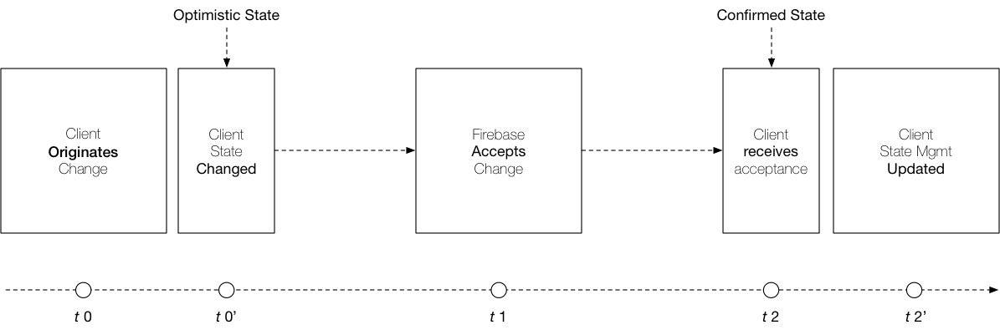
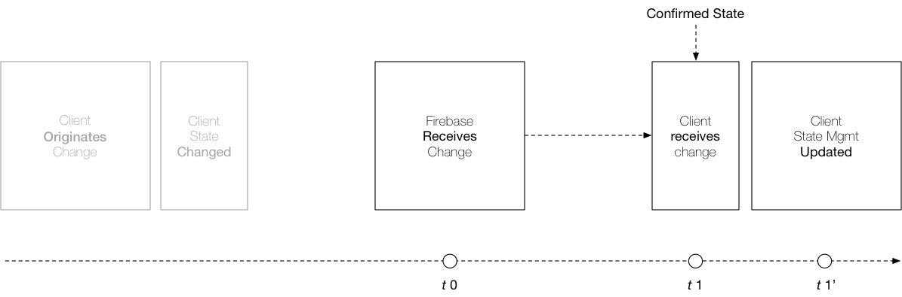

# Frontend State Mgmt

Without really meaning to start the conversation, the [Watching Firebase](./watching.html) section  brought up the idea of a "dispatch" function which gets called when a change takes place in Firebase which is being _watched_ by the client. For those of you familiar with Redux and/or Vuex (probably MobX too) there is shared nominclature in having a "dispatch" function. That's good as it suggests a possibly easy integration but that's just a part of the picture so let's explore the whole space.

Ultimately the goal we're trying to achieve is to find a low friction way of ensuring that the local datastore is kept optimistically up-to-date with changes in state. Changes that both originate with the client as well as those caused externally to the client.

### Being Optimistic

What is meant by _being optimistic_ in state management means simply that when a client originates a change, it should be able to respond to that change immediately even though a full round-trip to the database is needed before this change is formally accepted. That means that there is a lifecycle of client-originated change that looks like this:

This contrasts with changes in state that originate externally:

### Integrating Confirmed State

Let's start at the end first. Confirmed state -- the state change communication that comes from Firebase and to the client -- has two parts to it, one of which has already been largely discussed.

### Integrating Optimistic State

In **FireModel** the optimistic state is originated from the `Record` and `List` classes and has a 1:1 coorespondence with the write events discussed in the [writing to Firebase](./writing.html) section. Rather than leaving each of the events to the user though, **FireModel** has incorporated a simple shortcut in ensuring that all of these changes are passed through your frontend's state management dispatch pipeline.
